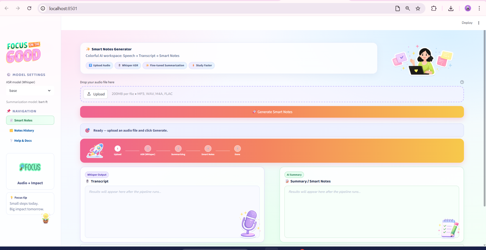

# Smart Notes Generator

Smart Notes Generator is an NLP mini-project that transforms speech into structured notes:

1. Audio input (mp3, wav, m4a)
2. Speech transcription (ASR)
3. Automatic summary / smart notes generation

This project is built with **Python + Streamlit + openai-whisper + HuggingFace Transformers**.

## Demo Interface

The Streamlit app displays transcript and summary side by side.

Add your screenshot here after your first run:



> Create the `assets/` folder and place your screenshot as `app-screenshot.png`.

## Project Structure

- `app.py`: Streamlit web app
- `asr.py`: teammate module exposing `transcribe(...) -> str`
- `summarization.py`: teammate module exposing `summarize(...) -> str`
- `requirements.txt`: Python dependencies

## Run Locally

```bash
conda activate study
pip install -r requirements.txt
streamlit run app.py
```

Then open the local URL shown in the terminal (usually `http://localhost:8501`).

## Integration Contract

The app imports:

```python
from asr import transcribe
from summarization import summarize
```

Expected behavior:

- `transcribe(audio_path: str) -> str`
- `summarize(text: str) -> str`

Both functions must return plain strings.

## GitHub Setup (Team)

1. Create a new repository on GitHub (for example: `smart-notes-generator`).
2. In your project folder:

```bash
git init
git add .
git commit -m "Initial commit: Streamlit app scaffold"
git branch -M main
git remote add origin https://github.com/<your-username>/smart-notes-generator.git
git push -u origin main
```

3. Add collaborators:
   - GitHub repo -> **Settings** -> **Collaborators and teams** -> **Add people**
   - Invite your 3 teammates by username/email.

## Deploy on Streamlit Community Cloud

1. Push latest code to GitHub.
2. Go to [https://share.streamlit.io](https://share.streamlit.io).
3. Click **New app**.
4. Select your repo, branch `main`, and main file `app.py`.
5. Click **Deploy**.

If deployment fails due to system packages (audio codecs), add a `packages.txt` file when needed.

## Report Assembly (Final Deliverable)

Include the following sections in your final report:

1. Introduction and problem statement
2. Method overview and pipeline (audio -> transcript -> summary)
3. ASR module summary (teammate section)
4. Summarization module summary (teammate section)
5. Streamlit app, GitHub workflow, and deployment (your section)
6. Results and qualitative examples
7. Conclusion and possible improvements

### Suggested Improvements

- Better punctuation restoration and speaker diarization
- Domain-adapted summarization model
- Multilingual support
- Evaluation metrics (WER for ASR, ROUGE/BERTScore for summaries)
