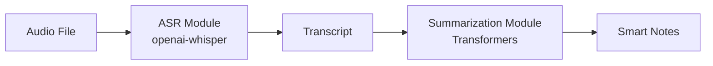

# Smart Notes Generator - Final Report

## 1. Introduction and Problem Statement

- Context: students/researchers often spend significant time turning spoken content into structured notes.
- Problem: manual note-taking is slow, error-prone, and difficult to review.
- Objective: build an NLP pipeline that converts speech into transcript, then into concise smart notes.

## 2. Project Objectives

- Build an end-to-end speech-to-notes prototype.
- Integrate ASR and summarization modules.
- Deliver a user-facing web app and free cloud deployment.

## 3. Method and Pipeline Overview

### 3.1 Pipeline Steps

1. Audio input (mp3/wav/m4a)
2. Speech transcription (ASR)
3. Text summarization (smart notes)
4. Display in Streamlit app

### 3.2 Pipeline Diagram

## 4. ASR Module (Teammate Section)

- Model choice
- Preprocessing steps
- Inference setup
- Example output
- Challenges and limitations

## 5. Summarization Module (Teammate Section)

- Model choice
- Prompting or summarization strategy
- Postprocessing
- Example output
- Challenges and limitations

## 6. Streamlit App, GitHub Setup, and Deployment (Your Section)

### 6.1 Streamlit App

- File uploader for mp3/wav/m4a
- Run pipeline button
- Side-by-side transcript and summary display

### 6.2 GitHub Collaboration

- Repository creation
- Branch strategy
- Collaborator management

### 6.3 Deployment on Streamlit Community Cloud

- Connected GitHub repository
- App entry file (`app.py`)
- Public app URL and screenshots

## 7. Experimental Results and Discussion

- Qualitative examples (input audio, transcript quality, summary quality)
- Error analysis
- Comparison across samples or speakers

## 8. Conclusion and Possible Improvements

- Main achievements
- Current limitations
- Future work:
  - Better ASR robustness for noisy audio
  - Domain-adapted summarization
  - Multilingual support
  - Automatic evaluation metrics (WER, ROUGE, BERTScore)

## 9. References

- Whisper documentation/paper
- Hugging Face Transformers docs
- Streamlit docs
